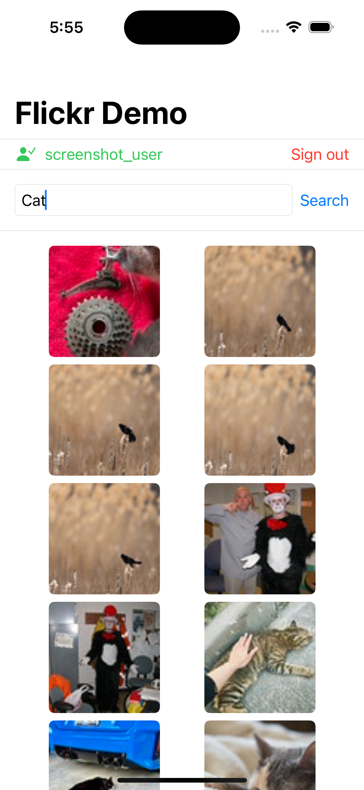

# AWFlickrServices


A dependency-free Swift Package for integrating the Flickr API in iOS and macOS applications.
Uses a **protocol mixin pattern** — conform any Swift type to `FlickrOAuthProtocol`
or `FlickrPhotosProtocol` and get full API access through protocol extension default
implementations. No subclassing or dependency injection required.

## Version

* 2.0.0

## Requirements

* Xcode 16+ / Swift 5.9
* iOS 16+ **or** macOS 12+
* A Flickr API Key (and Secret for OAuth operations)

## Package capabilities

| Protocol | Methods | OAuth required |
|---|---|---|
| `FlickrPhotosProtocol` | `getPhotos`, `downloadImageData`, `getInfo`, `getComments` | No |
| `FlickrPhotosProtocol` | `fave`, `unfave`, `comment` | Yes |
| `FlickrOAuthProtocol` | `performOAuthFlow` | — (drives the sign-in flow) |

All public model types conform to `Sendable`.

## Migrating from v1

| v1 | v2 |
|---|---|
| `FlickrPhotosRequest(text:page:per_page:)` — `page`/`per_page` are `String` | `page`/`per_page` are `Int` |
| `Comment._content` | `Comment.content` |
| `getImage(from:completion:)` returns `UIImage` | `downloadImageData(from:completion:)` returns `Data` |
| iOS 13+ | iOS 16+ |

## Installation

In Xcode: **File → Add Package Dependencies**, paste the repository URL, and select version `3.0.0`.

In `Package.swift`:

```swift
dependencies: [
    .package(url: "https://github.com/asafw/AWFlickrServices", from: "3.0.0")
],
targets: [
    .target(
        name: "YourTarget",
        dependencies: ["AWFlickrServices"]
    )
]
```

---

## Architecture

AWFlickrServices uses **protocol mixins**: every method is declared in a protocol and fully implemented in a `public extension`. Conforming your own type gives it all methods for free — no service object to hold onto, no initialiser to call.

```swift
// Any Swift type works — all methods come from the protocol extension defaults
struct PhotoRepository: FlickrPhotosProtocol { }
let repo = PhotoRepository()
let photos = try await repo.getPhotos(apiKey: "KEY", photosRequest: request)
```

### Injecting a custom `URLSession`

Both `FlickrPhotosProtocol` and `FlickrOAuthProtocol` expose a `urlSession` requirement
with a default implementation that returns `URLSession.shared`. Override it to provide a
custom session — for example, to intercept traffic in tests or to configure timeouts:

```swift
// Inject a URLProtocol-backed session for unit tests
struct TestRepository: FlickrPhotosProtocol {
    let urlSession: URLSession   // init with URLSession(configuration: ephemeralWithStub)
}

// Or configure caching / timeouts for production
struct PhotoRepository: FlickrPhotosProtocol {
    var urlSession: URLSession {
        let config = URLSessionConfiguration.default
        config.timeoutIntervalForRequest = 10
        return URLSession(configuration: config)
    }
}
```

The internal HTTP layer (`FlickrAPIService`) is not part of the public API — `URLSession`
is exposed instead so consumers get full session control without coupling to internal types.

---

## Data types

### Request types

| Type | Fields |
|---|---|
| `FlickrPhotosRequest` | `text: String`, `page: Int`, `per_page: Int` |
| `FlickrInfoRequest` | `photo_id: String`, `secret: String` |
| `FlickrCommentsRequest` | `photo_id: String` |
| `FlickrFaveRequest` | `photo_id: String` |
| `FlickrCommentRequest` | `photo_id: String`, `comment_text: String` |

All request types conform to `Sendable`.

### Response types

#### `FlickrPhoto`

Returned in arrays from `getPhotos`.

```swift
public struct FlickrPhoto: Decodable, Sendable {
    public let id: String
    public let owner: String?   // owner NSID — present in faves responses
    public let secret: String
    public let server: String
    public let farm: Int
    public let title: String

    // URL helpers
    public func thumbnailPhotoURLString() -> String  // 75×75 px square
    public func largePhotoURLString() -> String      // up to 1024 px on longest side
}
```

Example:

```swift
let url = URL(string: photo.largePhotoURLString())
// → "https://farm4.staticflickr.com/3/12345678_abcdef00_b.jpg"
```

#### `FlickrInfoResponse`

Returned from `getInfo`.

```swift
public struct FlickrInfoResponse: Decodable, Sendable {
    public let photo: PhotoInfo
}

public struct PhotoInfo: Decodable, Sendable {
    public let owner: Owner
    public let dates: Dates
    public let views: String    // numeric string, e.g. "4821"
}

public struct Owner: Decodable, Sendable {
    public let realname: String
    public let location: String?   // nil if the owner hasn't set a location
}

public struct Dates: Decodable, Sendable {
    public let taken: String    // "YYYY-MM-DD HH:MM:SS"
}
```

#### `AccessTokenResponse`

Returned from `performOAuthFlow` on successful sign-in.

```swift
public struct AccessTokenResponse: Decodable, Sendable {
    public let fullname: String
    public let oauth_token: String
    public let oauth_token_secret: String
    public let user_nsid: String
    public let username: String
}
```

Persist `oauth_token` and `oauth_token_secret` (e.g. in the Keychain) — both are required for every authenticated call.

### `FlickrAPIError`

All `async throws` methods throw `FlickrAPIError`. Use a `do/catch` block for structured error handling:

```swift
public enum FlickrAPIError: Error, Equatable {
    case parsingError                      // unexpected server response shape
    case networkError                      // non-2xx HTTP status
    case apiError(code: Int, message: String)  // Flickr stat:fail (HTTP 200 with error body)
}
```

Common `apiError` codes:

| Code | Meaning |
|---|---|
| 1 | Photo not found |
| 2 | Photo is not in faves (unfave without a prior fave) |
| 100 | Invalid API Key |
| 105 | Service currently unavailable |

---

## Usage

All network callbacks fire on the **URLSession background queue**. Always dispatch UI updates to the main thread:

```swift
getPhotos(apiKey: apiKey, photosRequest: request) { [weak self] result in
    // ⚠️ background thread
    if case .success(let photos) = result {
        DispatchQueue.main.async { self?.photos = photos }
    }
}
```

---

### FlickrOAuthProtocol

`performOAuthFlow` runs the full three-legged OAuth 1.0a flow: request token → user authorization (in-app web sheet) → access token.

On iOS, conform a `UIViewController` to both `FlickrOAuthProtocol` and `ASWebAuthenticationPresentationContextProviding`:

```swift
import AWFlickrServices
import AuthenticationServices

class AuthViewController: UIViewController,
                          FlickrOAuthProtocol,
                          ASWebAuthenticationPresentationContextProviding {

    var oauthToken       = ""
    var oauthTokenSecret = ""

    func presentationAnchor(for session: ASWebAuthenticationSession) -> ASPresentationAnchor {
        view.window ?? ASPresentationAnchor()
    }

    func signIn() {
        performOAuthFlow(
            from: self,
            apiKey: "YOUR_API_KEY",
            apiSecret: "YOUR_API_SECRET",
            callbackUrlString: "myapp://flickr-oauth"
        ) { [weak self] result in
            switch result {
            case .success(let response):
                self?.oauthToken       = response.oauth_token
                self?.oauthTokenSecret = response.oauth_token_secret
                print("Signed in as", response.username)
            case .failure(let error):
                print("Sign-in failed:", error)
            }
        }
    }
}
```

On macOS, supply a dedicated `PresentationContext` that returns `NSApp.keyWindow`. See [`Examples/FlickrDemoApp/PresentationContext.swift`](Examples/FlickrDemoApp/PresentationContext.swift) for a ready-to-copy cross-platform implementation.

---

### FlickrPhotosProtocol

#### getPhotos

Search for photos by keyword. Returns `[FlickrPhoto]`.

```swift
let request = FlickrPhotosRequest(text: "golden gate", page: 1, per_page: 25)
getPhotos(apiKey: apiKey, photosRequest: request) { result in
    switch result {
    case .success(let photos):
        // [FlickrPhoto] — use photo.id, .title, .thumbnailPhotoURLString(), etc.
        photos.forEach { print($0.title) }
    case .failure(let error as FlickrAPIError):
        switch error {
        case .networkError: print("Network error")
        case .apiError(let code, let msg): print("Flickr error \(code): \(msg)")
        default: break
        }
    case .failure(let error): print(error)
    }
}
```

**Pagination** — increment `page` to load the next batch:

```swift
var page = 1

func loadMore() {
    let request = FlickrPhotosRequest(text: "landscape", page: page, per_page: 25)
    getPhotos(apiKey: apiKey, photosRequest: request) { [weak self] result in
        if case .success(let photos) = result {
            DispatchQueue.main.async {
                self?.allPhotos.append(contentsOf: photos)
                self?.page += 1
            }
        }
    }
}
```

---

#### downloadImageData

Downloads raw image bytes from any URL. Uses `.returnCacheDataElseLoad` — repeated calls for the same URL skip the network. Returns `Data`; convert to `UIImage` / `NSImage` yourself.

```swift
guard let url = URL(string: photo.largePhotoURLString()) else { return }

downloadImageData(from: url) { result in
    switch result {
    case .success(let data):
        DispatchQueue.main.async {
            self.imageView.image = UIImage(data: data) // NSImage(data:) on macOS
        }
    case .failure:
        break // show placeholder
    }
}
```

Thumbnails use the same method — just call `photo.thumbnailPhotoURLString()` instead.

---

#### getInfo

Fetches metadata for a single photo: owner name and optional location, date taken, and total view count.

```swift
let request = FlickrInfoRequest(photo_id: photo.id, secret: photo.secret)
getInfo(apiKey: apiKey, infoRequest: request) { result in
    switch result {
    case .success(let response):
        print(response.photo.owner.realname)        // "Alice Smith"
        print(response.photo.owner.location ?? "")  // "Paris, France" or nil
        print(response.photo.dates.taken)           // "2021-07-04 12:30:00"
        print(response.photo.views)                 // "4821"
    case .failure(let error):
        print("getInfo failed:", error)
    }
}
```

---

#### getComments

Returns all comment texts on a photo as `[String]`.

```swift
let request = FlickrCommentsRequest(photo_id: photo.id)
getComments(apiKey: apiKey, commentsRequest: request) { result in
    switch result {
    case .success(let comments):
        comments.forEach { print($0) }   // plain text of each comment
    case .failure(let error):
        print("getComments failed:", error)
    }
}
```

---

#### fave / unfave *(OAuth required)*

```swift
let request = FlickrFaveRequest(photo_id: photo.id)

// Fave
fave(
    apiKey: apiKey, apiSecret: apiSecret,
    oauthToken: oauthToken, oauthTokenSecret: oauthTokenSecret,
    faveRequest: request
) { result in
    if case .failure(let error) = result { print("Fave failed:", error) }
}

// Unfave
unfave(
    apiKey: apiKey, apiSecret: apiSecret,
    oauthToken: oauthToken, oauthTokenSecret: oauthTokenSecret,
    faveRequest: request
) { result in
    if case .failure(let error) = result { print("Unfave failed:", error) }
}
```

Both return `Result<Void, Error>` — `.success(())` on success.

---

#### comment *(OAuth required)*

```swift
let request = FlickrCommentRequest(photo_id: photo.id, comment_text: "Great shot!")
comment(
    apiKey: apiKey, apiSecret: apiSecret,
    oauthToken: oauthToken, oauthTokenSecret: oauthTokenSecret,
    commentRequest: request
) { result in
    switch result {
    case .success:
        print("Comment posted")
    case .failure(let error):
        print("Comment failed:", error)
    }
}
```

---

## Demo App

A demo app under `Examples/` demonstrates all seven `FlickrPhotosProtocol` methods plus the full OAuth flow. The same SwiftUI source files run on both macOS and iOS.

### Screenshots

#### iOS

| Empty state | Signed in | Search results |
|:-----------:|:-----------:|:-----------:|
|  |  |  |
| **Photo detail** | **Authenticated search** | **Authenticated detail** |
|  |  |  |

#### macOS

| Empty state | Search results | Photo detail |
|:-----------:|:-----------:|:-----------:|
|  |  |  |

### Running on macOS

```bash
# Option 1 — environment variable (no files left on disk)
FLICKR_API_KEY=your_api_key swift run FlickrDemoApp

# Option 2 — credential file
echo "your_api_key" > /tmp/flickr_api_key
swift run FlickrDemoApp
```

Run from the package root (`AWFlickrServices/` directory).

### Running on iOS Simulator

**Option 1 — command line (no Xcode needed after first build):**

```bash
cd Examples/FlickrDemoApp-iOS
xcodegen generate   # only needed once, or after project.yml changes

# Build
xcodebuild -scheme FlickrDemoApp-iOS \
  -destination 'platform=iOS Simulator,name=iPhone 16' \
  -configuration Debug build

# Boot simulator and install
UDID=$(xcrun simctl list devices booted | grep 'iPhone 16' | head -1 | grep -oE '[A-F0-9-]{36}')
xcrun simctl boot "$UDID" 2>/dev/null; open -a Simulator
xcrun simctl install "$UDID" \
  ~/Library/Developer/Xcode/DerivedData/FlickrDemoApp-iOS-*/Build/Products/Debug-iphonesimulator/Flickr\ Demo.app

# Launch with API key
# SIMCTL_CHILD_ prefix passes the variable directly to the app process
SIMCTL_CHILD_FLICKR_API_KEY="$(cat /tmp/flickr_api_key)" \
  xcrun simctl launch "$UDID" com.example.flickrdemo
```

**Option 2 — Xcode:**

```bash
cd Examples/FlickrDemoApp-iOS
xcodegen generate
open FlickrDemoApp-iOS.xcodeproj
```

Set `FLICKR_API_KEY` in **Product → Scheme → Edit Scheme → Run → Arguments → Environment Variables**, then ⌘R. If the variable is absent an API Key field appears in the app UI.

Layout adapts automatically: VStack on iPhone, HStack sidebar on iPad and macOS.

---

## See also

[docs/INTEGRATION.md](docs/INTEGRATION.md) — full integration walkthrough with additional examples for pagination, cross-platform image handling, Keychain persistence, and `@MainActor` usage patterns.

